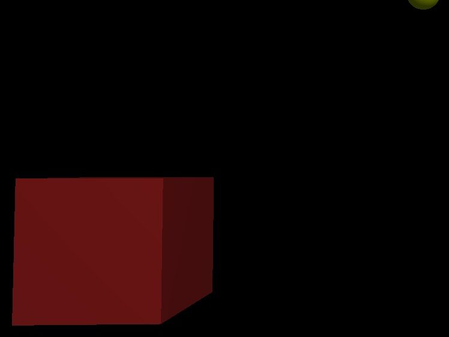

### Hello World 👋
- 🔭 I’m currently working in C# with Blazor and .NET Core
- 🌱 I’m always learning Software Development
- ⚡ Projects: Solving Renewable Energy problems
- ✨ Fun fact: Kölsch is the local beer in Cologne

Checkout my: [LinkTree](https://linktr.ee/ianharcourtsmith) and [Personal Website](https://ianharcourtsmith.com/)

<!--
**IanEarnest/IanEarnest** is a ✨ _special_ ✨ repository because its `README.md` (this file) appears on your GitHub profile.

Here are some ideas to get you started:

- 👯 I’m looking to collaborate on ...
- 🤔 I’m looking for help with ...
- 💬 Ask me about ...
- 📫 How to reach me: ...
- 😄 Pronouns: ...

-->
